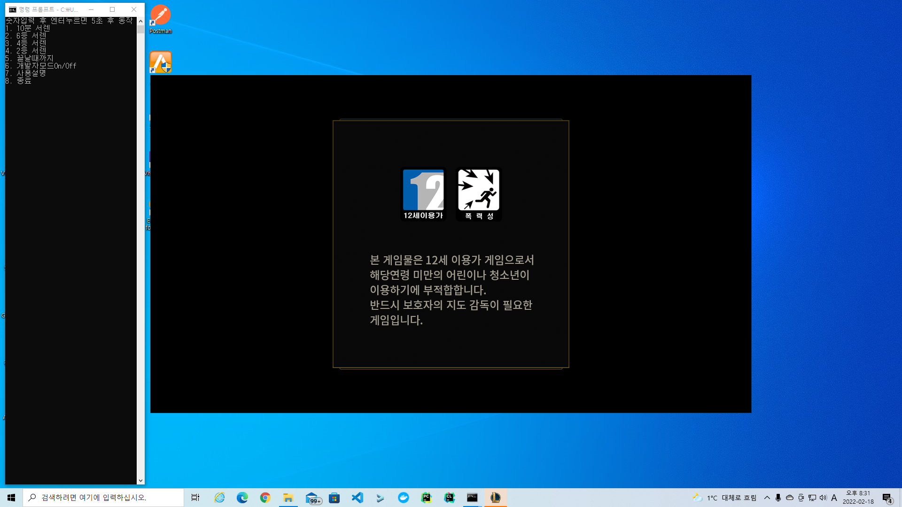

# 롤토체스 매크로
## 요구사항
- 롤 시즌패스, 시즌패스를 구매하지 않으면 아무런 의미가 없습니다. 시즌패스 구매자가 아니면 토큰보상이 없습니다.
- python
- 영문사용자경로, 사용자경로가 한글경로면 오류납니다. (해결방법: 파이썬 설치시 특정사용자가 아니라 모든 사용자용으로 설치, 윈도우 임시파일 경로 변경)
- 해상도 1920x1080, 롤해상도 1920x1080전체화면, 롤클라이언트해상도 1280x720, 윈도우 디스플레이설정 배율 100%

## 설치
cmd 창에서
```shell
pip install pyautogui
```

## 실행
cmd 창 해당폴더 위치에서
```shell
python handycalcXX.py
```
또는 <br> cmd 창에 python 치고 handycalc파일 드래그앤드랍 후 엔터.

롤토체스 큐 대기화면에서 실행 권장.

일시정지는 마우스커서를 화면의 4모서리중 한곳으로 옮기면 일시정지됩니다.

매 시즌 게임모드가 추가되고 없어지면서, 롤 클라이언트 첫 화면에서 큐 화면으로 진입 하는 기능이 잘 동작하지 않을 수 있습니다. <br>
그때는 home_to_find() 함수의 클릭위치를 변경해주어야 하는데, checker2.py 를 더블클릭하거나 따로 실행하면 현재 마우스 위치가 나오니,
그걸 참고하면 수월합니다.

## 주의사항 
일시정지는 마우스커서를 화면의 4모서리중 한곳으로 옮기면 일시정지됩니다. <br>
무엇이던간에 롤클라이언트나 롤 인게임화면을 가리고 있으면 안됩니다. <br>
본 프로그램의 실행 창이 오른쪽 화면을 가리도록 하지 마십시오(롤 클라이언트 기준 오른쪽).
특히 플레이어들의 순위를 표시하는 부분을 가리면 안됩니다. <br>
권장되는 실행창 위치는 다음과 같습니다. 꼭 지킬 필요는 없습니다. <br>

롤클라이언트 위치가 첫 실행때 그 위치를 그대로 유지해야 합니다. 1픽셀이라도 어긋날 시 작동 안할 수도 있습니다. 


## 기타
- [x] handycalc22 제작 예정
